## Project Background
Main Project Objective: **Analyse global news, industry discussions, government policies, and customer feedback from Jan 2024 till-date, to help Tech giant (Apple) identify risks and/or opportunities and plan for its next iPhone^ rollout.**

^Note: We focus on iPhone. It generated USD69B in FY24, accounting for 55% of total revenue, the largest among product lines like Mac and wearables.

## Work Accomplished
The business objective #1 that I am currently working on is to "Analyse global online journals and news articles to sources which contain emerging risks and/or opportunities, enabling proactive decision-making".
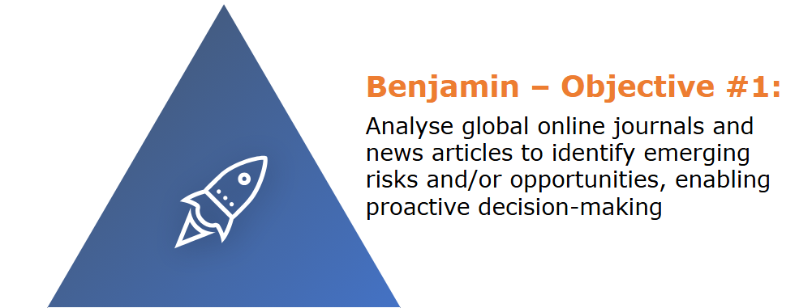

I will take the following steps to perform my analysis, as part of the CRISP-DM model.
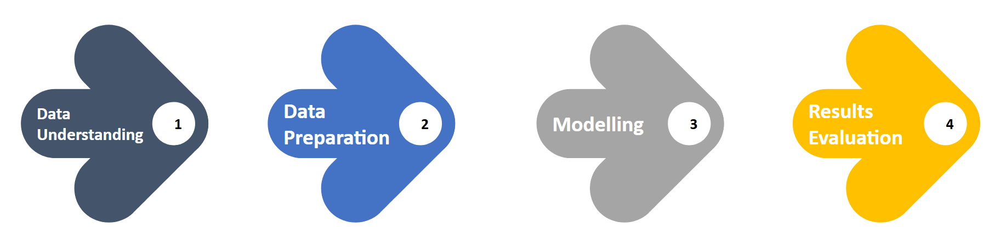

### Data Understanding
There are 3 steps I will need to take to identify emerging risks and/or opportunities to enable proactive decision making.
- 1st: Identify annual reports that could be of relevance based on the following pre-identified key risks - Human Capital Risk and ESG Risk (Climate). For the purpose of this example I will be looking at only ESG Risk (Climate).
- 2nd: After cleaning the data (stopwords, etc), use term frequency analysis to find common words within these reports to build up relevant keywords. For the purpose of this example I will be using the file Climate Action Network. The Climate Action Network has developed trackers that measure how countries around the world are progressing in their climate change goals and renewable energy targets.
- 3rd: Use a webscrapper (ParseHub) to scrape text off news articles using these keywords to find relevant articles pertaining to these risks.

**This analysis will be split into 2 parts:
Part A (Extracting Keywords from the Topic Journal)
Part B (Using Keywords identified from Part A to scrape relevant news articles)

### Data Preparation for Part A
1. Extract text from a downloaded PDF File - Climate Action Network.pdf (Total of 87 pages).
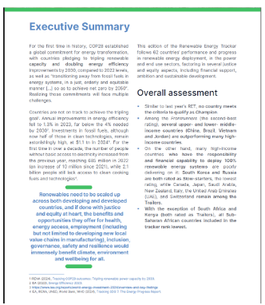

2. Performing text processing - Tokenize into sentences and words, remove punctuations, stopwords and numbers.
3. Perform stemming and lemmatization

Output as follows:
**Top 20 words after stemming and lemmatization**
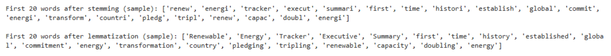

**Word Frequency Graph**
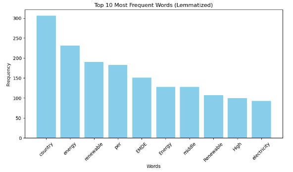

**WordCloud**
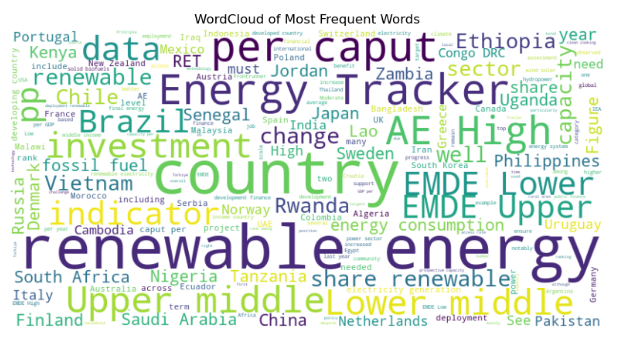

*The list of 200 words will be used for filtering articles that have been webscrapped from a news website (Digital Journal) to increase its relevance to the ESG sector.*

### Data Preparation for Part B (Using Keywords in Part B)
1. Use Parsehub to scrape from Digital Journal (10 pages worth)
Data Breakdown - 10 pages, 116 articles (Refer to "Content" column for analysis)
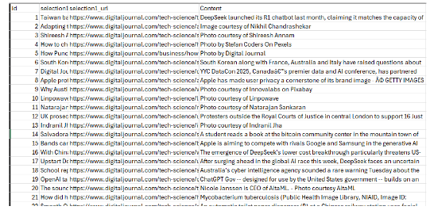

2. Perform text-proprocessing
  a. Tokenize into sentences and words
  b. Remove punctuations, stopwords and numbers
  c. Perform stemming and lemmatization

3. Filter articles based on ESG keywords found in Part A and keep only articles that have these keywords.
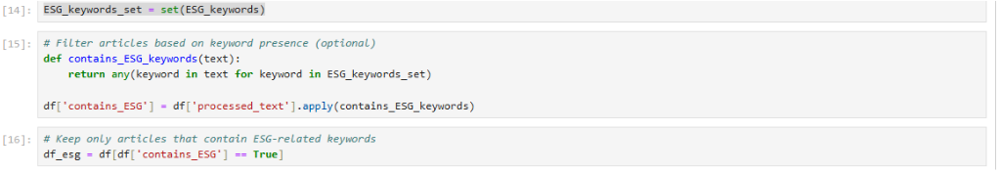

4. Prepare word representation to begin performing LDA analysis for data modelling.

### Modelling (Only applies to Part B)
Start by creating an LDA model with 10 topics and 10 words in each topic.

Output as follows:
**LDA Model**
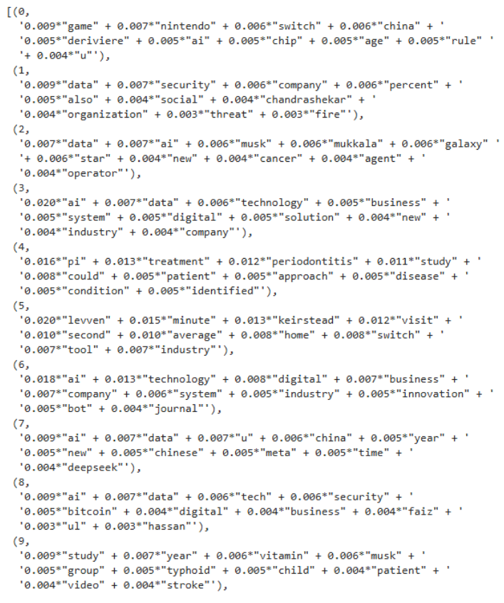

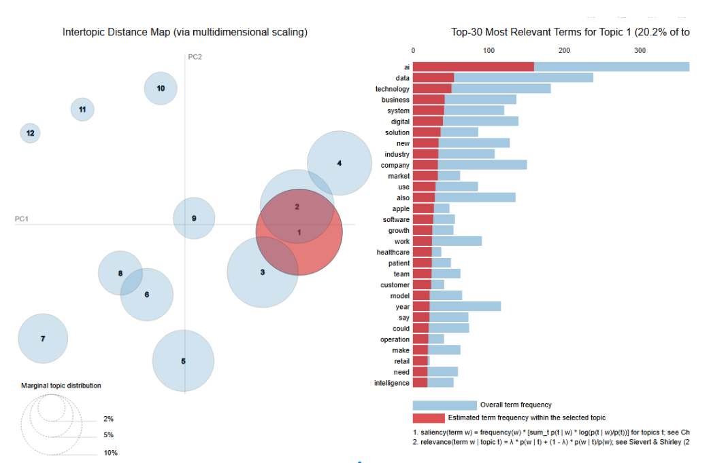

There is a high focus on AI, Data and Technology. This is in-line with Digital Journal’s content as per the description on their website: Digital Journal is an online news platform that provides coverage on various topics, including global events, politics, business, technology, entertainment, and more.

### Evaluation
To further improve the model, find out the coherence score. Perform a test of topics from range (2,20)
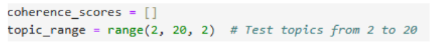

**Coherence Graph**
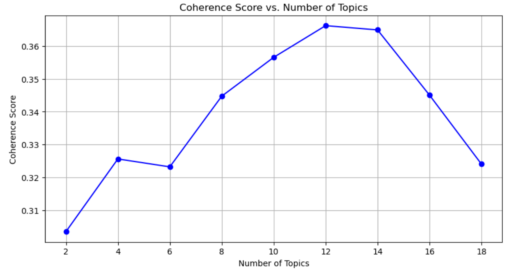

Currently at 10 topics, coherence score is 0.34517. 
Changing to 12 topics, coherence score is 0.36738.
**The coherence score suggests that 12 topics provide the most interpretable and meaningful structure in the data.**

## Recommendation and Analysis
###Final Recommendation (for n=10 topics)
Topic 0: This topic is **relevant** to Apple in terms of AI, chips, and gaming (Switch, Nintendo). While Apple focuses on AI, chips, and gaming integration through platforms like Apple Arcade, it's more directly associated with gaming and technology.
Topic 1: This topic is **highly relevant** due to Apple's focus on data security and privacy, particularly in the context of their user data protection measures. Apple's reputation centers on its commitment to user security.
Topic 2: Apple has **less relevancy** connected to topics like Musk, Galaxy, and cancer, but the AI and data aspects have relevance, particularly in how AI is used in Apple's products (like Siri and machine learning models).
Topic 3: This topic is **highly relevant** to Apple, as it focuses on AI, technology, digital systems, and business solutions, all core aspects of Apple's operations in developing cutting-edge products and services.
Topic 4: This topic seems **less relevant** to Apple, as it pertains more to medical studies, particularly periodontitis and treatment, which doesn't directly tie into Apple's primary focus on consumer tech
Topic 5: This topic appears **less relevant**, though the mention of switch could loosely connect to Apple’s hardware and industry focus, but the rest is less aligned with their focus.
Topic 6: This topic is **relevant**, given the mention of AI, technology, business, and innovation. Apple's commitment to innovation and the tech industry makes this highly aligned with their brand
Topic 7: This topic is **somewhat relevant** due to the AI, China, and data aspects. While Apple has significant operations in China, the topic also includes references to other entities like Meta and specific AI tools, which may not be as directly aligned.
Topic 8: This topic is **relevant** due to the focus on AI, technology, security, and digital business, aligning with Apple's areas of focus, especially with regard to AI and security features in their devices.
Topic 9: This topic is **not directly relevant** to Apple, as it focuses on health studies like vitamin, stroke, and typhoid, which don't align with Apple’s core business areas.

To achieve the business objective, the next step would be to only pull out the articles related to the relevant topics (and remove the rest) for management to have a read.

###Suggestions for improvement
*How can we further improve the model?*
1. Adding additional stopwords in stop_words to the pre-processing stage to improve the quality of the text data used by the model, or using a consultantancy service to determine which words should fit a particular category.
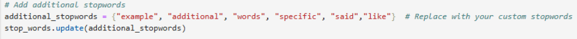

Filtering such words prevents bias where the model overweighs frequently occurring but uninformative terms (in this example, the term ‘u’).

2. Further refine the initial list of 200 words which were scrapped from the topic journal (in this case, ESG).
A more refined keyword list means the filtering process removes irrelevant articles that only mention ESG-related terms incidentally.

3. Lastly, in a real-life scenario and fully achieve the actual business objective, to scrape additional sources covering a wide range of topics, not just limiting to digital journal which covers mainly tech news. This is because Apple would have other emerging risks such as Geopolitical, Infrastructure risk which would have to be taken into account.

###Next Steps
Based on the highly relevant topics (Topic 1,3,6,8), Apple can perform the following next steps:

**Topic 1: Data Security**
Launch a Comprehensive Privacy Dashboard for users across all Apple devices that provides transparency about data collection, usage, and sharing. This would enhance trust with consumers and align with Apple's reputation for data privacy, giving users full control over their personal data.
**Topic 3: AI and Technology**
Integrate AI in all Apple Services to provide more personalized and context-aware experiences, such as AI-driven recommendations across Apple Music, Apple TV+, and even iMessages. This would deepen the connection between users and the Apple ecosystem, enhancing user satisfaction and engagement.
**Topic 6: Digital Transformation and Innovation**
Develop an AI-powered enterprise toolkit to provide businesses with tools for productivity, collaboration, and workflow automation, leveraging Apple’s ecosystem. This could include machine learning models for data analytics, security, and team communication to broaden Apple’s enterprise customer base.
**Topic 8: Security and Digital Business**
Implement AI-driven security features to detect and respond to unusual activities in real-time, ensuring that Apple devices automatically identify potential threats like data breaches or cyberattacks. This would make Apple devices even more secure and position them as the safest on the market.

This would fulfil busines objective #1.

## AI Ethics
**Privacy**: If news articles contain personal or sensitive information, there’s a risk of violating privacy. Ensure data is anonymized and follows data protection laws.
**Fairness**: The model might be biased if the dataset is skewed or includes biased language, affecting topic relevance. Ensure a diverse and balanced dataset to mitigate this.
**Accuracy**: LDA’s unsupervised nature can lead to inaccurate topics if the model is not well-tuned. Regular evaluation is needed to ensure reliable outputs.
**Accountability**: If the model misleads stakeholders, you must be accountable for the consequences. Document the model’s assumptions and limitations clearly.
**Transparency**: LDA can be a black box, making it hard to explain its results. Provide clear visualizations and documentation to ensure stakeholders understand how the model works.

## Source Codes and Datasets
Upload your model files and dataset into a GitHub repo and add the link here. 
